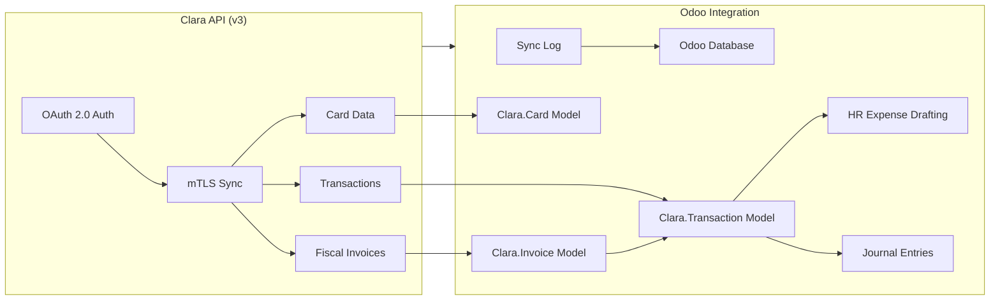

# Clara Odoo Connector

[](LICENSE)
[](https://www.odoo.com)
[](https://clara.com)

> [!WARNING]
> **THIS IS A TEMPLATE PROJECT**. 
> This repository is intended to be **FORKED** and customized for your specific Odoo environment. **Do not use this repository directly** in production without first forking it to your own organization or account to maintain control over your own configuration, certificates, and updates.

An open-source Odoo 17 module that integrates [Clara's Spend Management platform](https://clara.com) directly into your Odoo instance. Built for Clara customers who run Odoo and want to automate expense management, card visibility, and accounting reconciliation.

---

## Architecture



---

## 🚀 Key Features

### 🔹 Unified Card Management
- **Smart Sync**: Automatically fetches all active, inactive, and virtual Clara cards.
- **Dynamic Limits**: Tracks **Periodicity** (Daily, Monthly, etc.) and individual **Thresholds** directly from the Clara API v3.
- **Employee Mapping**: Automatically links Clara cards to Odoo `hr.employee` records based on cardholder names.

### 🔹 Fiscal Invoice Recovery (Mexico)
- **SAT Synchronization**: Recovers official fiscal documents (CFDI) directly from Clara's integration with the SAT.
- **Automatic Linking**: Automatically associates recovered XML/PDF metadata with the corresponding Clara transactions in Odoo.
- **Fiscal Metadata**: Captures SAT UUID, Issuer RFC, and total amounts for easier reconciliation.

### 🔹 Transaction Synchronization
- **Real-Time Data**: Syncs all corporate spend transactions, including merchant details, amounts, and currencies.
- **Automated Expense Creation**: Generates Odoo Employee Expenses (`hr.expense`) from Clara Card transactions.
- **Accounting Reconciliation**: Posts `account.move` journal entries linked to a configurable Clara liability account.

### 🔹 Enterprise-Grade Security
- **mTLS Integration**: Securely communicates with Clara using Mutual TLS; certificates are stored encrypted in the Odoo database.
- **Encrypted Storage**: Credentials and certificates are stored securely within Odoo (no on-disk files required).
- **Role-Based Access**: Specialized groups for **Clara User** (read-only) and **Clara Manager** (full access).

---

## 🛠 Installation & Setup

### 1. Module Deployment (Forked Workflow)
1. **Fork the repository**: Click the **Fork** button on the top right of this GitHub repository to create your own copy.
2. **Clone your fork**: Clone **your forked version** into your Odoo `addons` directory:
   ```bash
   git clone https://github.com/YOUR_ORG/odoo-connector.git
   ```
3. **Update Addons Path**: Ensure the directory is included in your `odoo.conf` file:
   ```ini
   addons_path = /path/to/odoo/addons,/path/to/clara-connector
   ```
4. **Restart Odoo**: Restart your Odoo server to detect the new module.
5. **Enable Developer Mode**: In Odoo, go to **Settings** and click **Activate the developer mode**.
6. **Update Apps List**: Navigate to the **Apps** menu and click **Update Apps List** in the top bar.
7. **Install**: Search for "Clara" and click **Install**.

### 2. Basic Configuration
1. Navigate to **Settings** > **Accounting** > **Clara Connector** (or click the Clara menu).
2. Select your **Region** (MX, CO, BR, etc.).
3. Enter your **Client ID** and **Client Secret** provided by Clara.

### 3. mTLS Certificate Setup
> [!IMPORTANT]
> To ensure a secure connection, you must upload your Clara-issued certificates in the **Certificates** tab of the configuration page.
- **CA Certificate**: Your root/intermediate certificate.
- **Client Certificate**: Your individual service certificate.
- **Client Key**: The private key associated with your certificate.

### 4. Verification
- Press the **Test Connection** button in the settings.
- A **Success** notification indicates Odoo is now communicating with Clara's Public API v3.

---

## 📁 User Guide

### Manual Synchronization
You can trigger a manual sync at any time:
1. Go to **Clara** > **Sync** > **Manual Sync**.
2. Choose your scope: **Transactions**, **Cards**, **Recovered Invoices**, or **Full Sync**.
3. Press **Run Sync Now**.

### Automated Sync (Cron)
The module includes a scheduled action (check Odoo **Scheduled Actions**) that runs automatically (default: every 4 hours).

### Dashboard & Tracking
- **Dashboard**: Live KPIs for monthly spend, pending expenses, and unposted entries.
- **Invoice Management**: Browse your recovered fiscal documents by navigating to **Clara** > **Invoices**. 
- **Traceability**: Linked transactions can be accessed directly from the invoice form view.

---

## 🖼 Screenshots

| **Dashboard** | **Transactions** |
| :---: | :---: |
|  |  |
| *Spend KPIs, sync status, and category breakdown* | *Full transaction list with status, merchant, and cardholder* |

| **Cards** | **Settings** |
| :---: | :---: |
|  |  |
| *Corporate card kanban grouped by status* | *API credentials, certificates, and accounting mapping* |

---

## 🆘 Support & Maintenance

- **Issues**: Report bugs or request features via the [GitHub Issues](https://github.com/clara-com/odoo-connector/issues) page.
- **API Status**: Check the [Clara Status Page](https://status.clara.com).

---
*Designed with ❤️ by the Clara Integration Team.*
