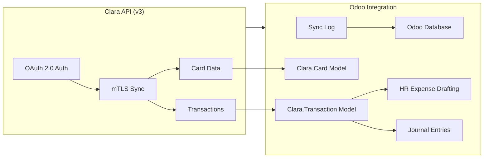

# Clara Odoo Connector

This project provides a robust integration between Clara's Spend Management ecosystem and Odoo. It is designed to be a starting point for developers who want to connect Clara with their Odoo instance or use it as a template for other ERP connectors.

## Visual Overview

### Data Flow & Architecture

### Screenshots (Placeholders)
> [!NOTE]
> Add your own screenshots here to showcase the live integration.

| **Dashboard View** | **Configuration View** |
| :---: | :---: |
|  |  |
| *Visualize spend analytics directly in Odoo* | *Secure API and Certificate Management* |

## Key Features
- **Secure Integration**: Uses mTLS and OAuth 2.0 for secure communication with Clara's v3 API.
- **Auto-Expense Creation**: Generates `hr.expense` records in Odoo from Clara transactions.
- **Reconciliation**: Facilitates smooth journal posting and account reconciliation.
- **Interactive Dashboards**: Spend visibility through custom Odoo dashboards.

## Project Structure
- `clara_connector/`: The core Odoo module (Addon).
- `docker-compose.yml`: Local development environment setup for Odoo and PostgreSQL.
- `.gitignore`: Standard Git ignore patterns for Odoo and Python development.

## Forking & Extensibility
This project is built with flexibility in mind. You can **fork this repository** to:
1. **Customize the Odoo Integration**: Modify the mapping logic, add custom fields, or change the synchronization frequency.
2. **Create New Connectors**: Use the existing architecture as a blueprint for connecting Clara to other ERP systems (e.g., SAP, Oracle, NetSuite).

## Getting Started
### Local Development with Docker
1. Clone the repository: `git clone <repo-url>`
2. Start the environment: `docker compose up -d`
3. Access Odoo at `http://localhost:8069`
4. Find the **Clara – Spend Management Integration** module in the Apps list and install it.

### Module Configuration
Follow the detailed guide in the [clara_connector/README.md](file:///Users/rafaelorihuela/Desktop/scratch/clara_connector/README.md) for API setup and certificate management.

---
*Built for the Clara Solutions Engineering Team.*
