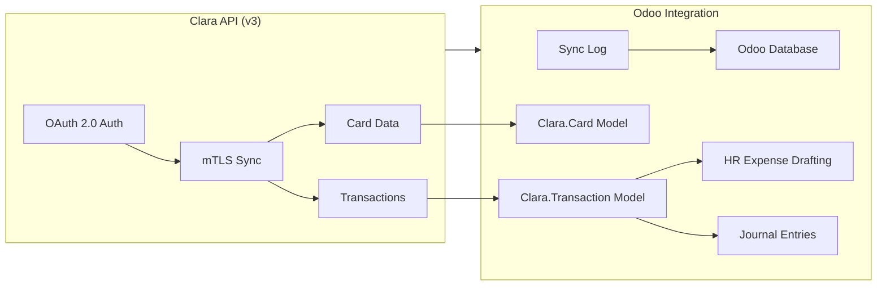
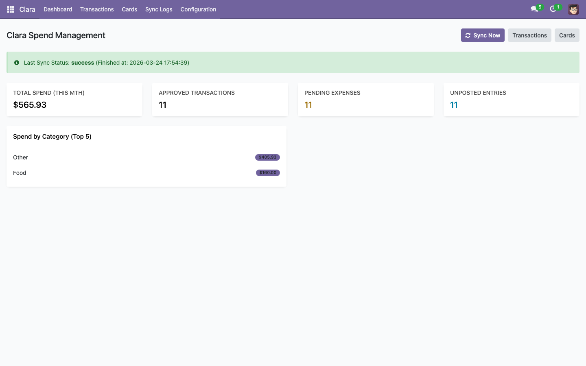
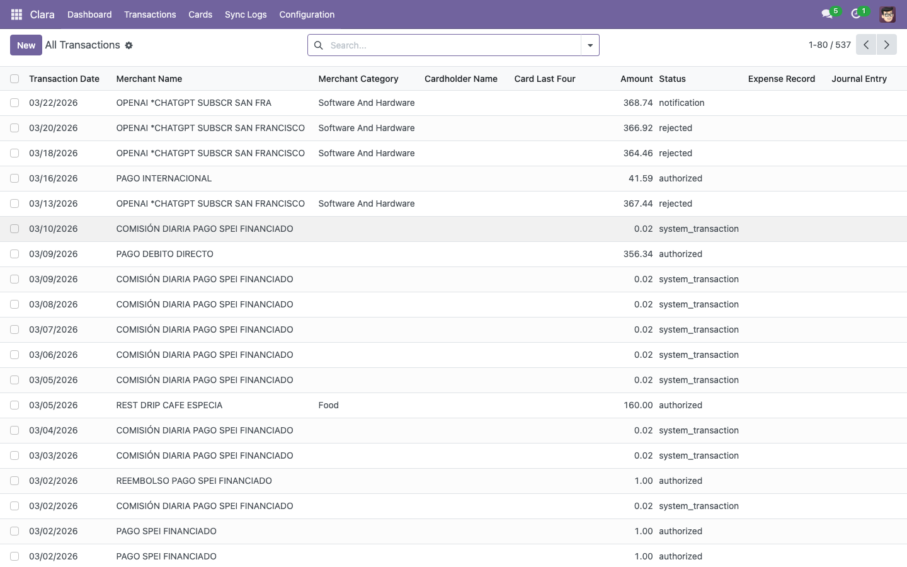
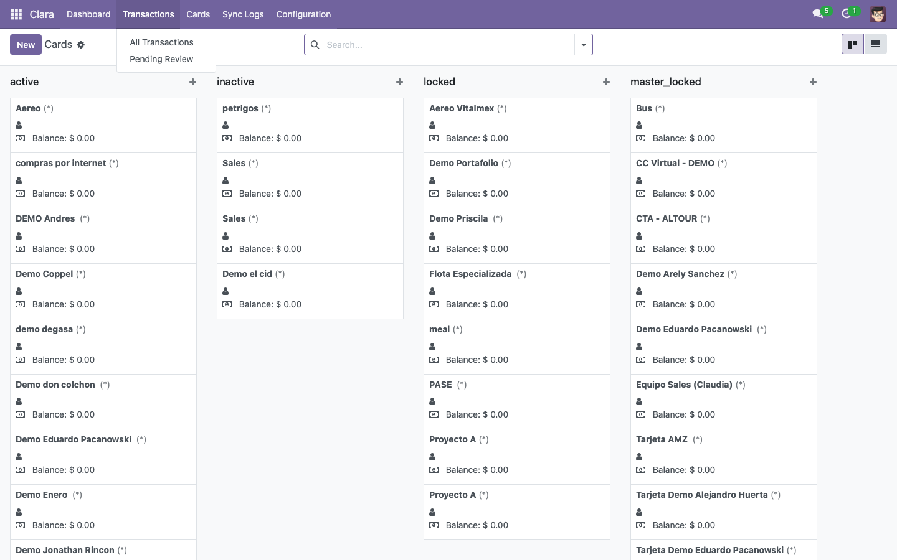
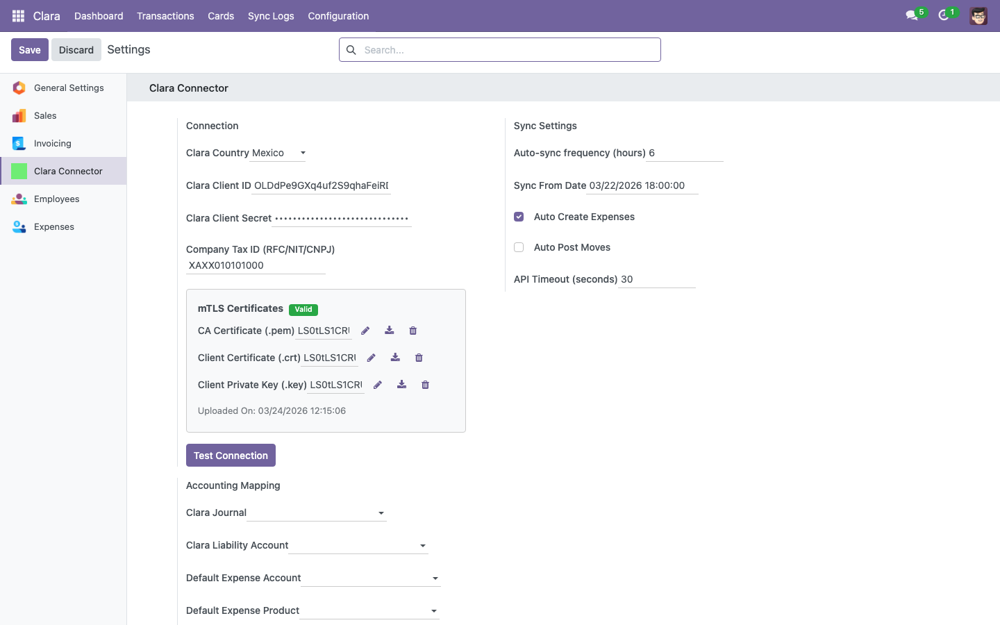

# Clara Odoo Connector

[](LICENSE)
[](https://www.odoo.com)
[](https://clara.com)

An open-source Odoo 17 module that integrates [Clara's Spend Management platform](https://clara.com) directly into your Odoo instance. Built for Clara customers who run Odoo and want to automate expense management, card visibility, and accounting reconciliation.

## Architecture



## Features

- **Secure Authentication** — OAuth 2.0 + mTLS; certificates are stored encrypted in the Odoo database (no on-disk files required)
- **Automated Expense Creation** — Generates `hr.expense` records from approved Clara transactions
- **Accounting Reconciliation** — Posts `account.move` journal entries linked to a configurable Clara liability account
- **Card Management** — Syncs corporate card status, limits, and balances with employee linking
- **Sync Logs** — Full audit trail of every sync operation with record counts and error details
- **Scheduled Sync** — Configurable cron jobs (default: transactions every 6 hours, cards daily)
- **Dashboard** — Live KPIs for monthly spend, pending expenses, and unposted entries
- **Multi-Country** — Supports Clara Mexico, Colombia, and Brazil API endpoints
- **Role-Based Access** — Clara User (read-only) and Clara Manager (full access) groups

## Requirements

- Odoo 17.0
- Clara account with API access (OAuth credentials + mTLS certificates)
- Odoo modules: `account`, `hr_expense`

## Getting Started

### Option 1 — Local Development with Docker

```bash
git clone https://github.com/clara-com/odoo-connector.git
cd odoo-connector
docker compose up -d
```

Access Odoo at `http://localhost:8069`, then find **Clara – Spend Management Integration** in the Apps list and install it.

### Option 2 — Existing Odoo Instance

1. Copy the `clara_connector/` directory into your Odoo `addons` path.
2. Restart the Odoo server.
3. Update the App List and install **Clara – Spend Management Integration**.

### Configuration

See the [module README](clara_connector/README.md) for the full configuration checklist (API credentials, certificates, and accounting mapping).

## Screenshots

| **Dashboard** | **Transactions** |
| :---: | :---: |
|  |  |
| *Spend KPIs, sync status, and category breakdown* | *Full transaction list with status, merchant, and cardholder* |

| **Cards** | **Settings** |
| :---: | :---: |
|  |  |
| *Corporate card kanban grouped by status* | *API credentials, certificates, and accounting mapping* |

## Project Structure

```
clara_connector/       # Odoo addon — copy this into your addons path
├── models/            # clara.transaction, clara.card, clara.sync.log
├── services/          # Clara API client (OAuth2 + mTLS)
├── views/             # List, form, kanban, dashboard XML views
├── wizards/           # Manual sync wizard
├── data/              # Cron jobs
├── security/          # Access groups and ACL rules
└── static/            # OWL dashboard component (JS/CSS/XML)
docker-compose.yml     # Local dev environment (Odoo 17 + PostgreSQL 15)
```

## Extending This Module

- **Custom field mappings** — Modify `models/clara_transaction.py` or `models/clara_card.py` to map additional Clara API fields.
- **New sync targets** — `ClaraAPIService` already exposes `get_billing_statements()` and `get_users()` endpoints ready to wire up.
- **Other ERPs** — `services/clara_api_service.py` is framework-agnostic and can be adapted for SAP, NetSuite, or any other system.

## Contributing

Contributions are welcome. Please read [CONTRIBUTING.md](CONTRIBUTING.md) before opening a pull request.

## License

[MIT](LICENSE) — free to use, modify, and distribute.
